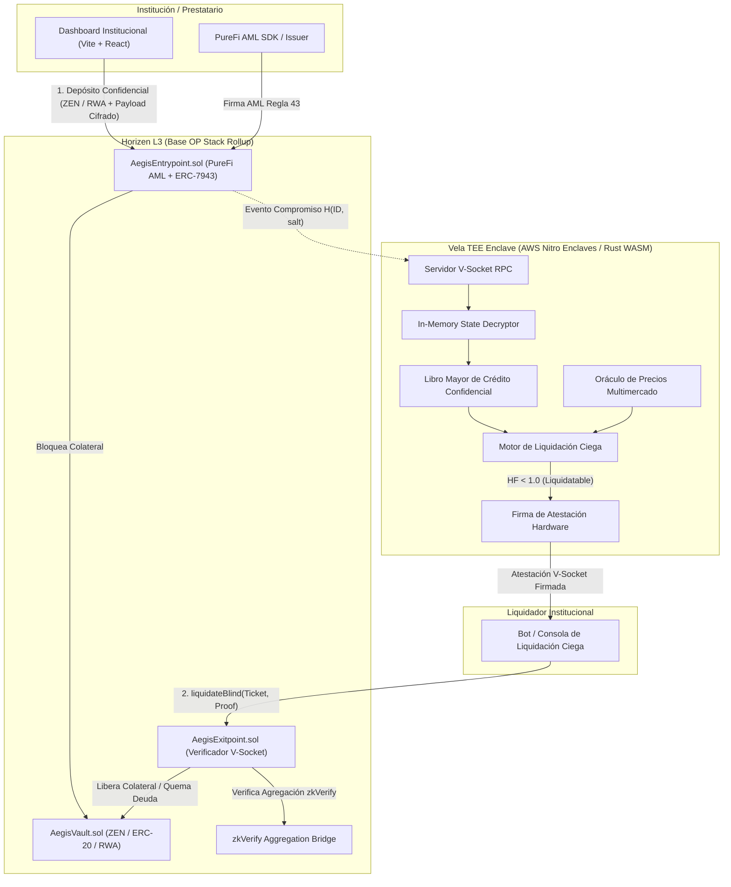

# Aegis Protocol (Aegis Credit) 🛡️

> **Institutional Confidential Borrow-Lend Protocol on Horizen L3 (Base OP Stack)**  
> *Protecting institutions, hedge funds, and HNWIs from public exposure and liquidation hunting via AWS Nitro Enclaves (Vela Coprocessor), zkVerify, and PureFi AML compliance.*

---

## 📑 Tabla de Contenidos
1. [Visión General y Justificación](#-visión-general-y-justificación)
2. [Arquitectura del Sistema](#-arquitectura-del-sistema)
3. [Componentes Principales](#-componentes-principales)
   - [Contratos Inteligentes EVM (`/contracts`)](#1-contratos-inteligentes-evm-contracts)
   - [Motor Confidencial TEE Vela (`/tee-enclave`)](#2-motor-confidencial-tee-vela-tee-enclave)
   - [Frontend Institucional (`/frontend`)](#3-frontend-institucional-frontend)
   - [Cumplimiento Normativo y AML (`PureFi` & `ERC-7943`)](#4-cumplimiento-normativo-y-aml)
4. [Mecanismo de Liquidación Ciega (Blind Liquidation)](#-mecanismo-de-liquidación-ciega-blind-liquidation)
5. [Red de Pruebas Oficial (Testnet)](#-red-de-pruebas-oficial-testnet)
6. [Suite de Pruebas y Verificación](#-suite-de-pruebas-y-verificación)
7. [Guía de Instalación y Ejecución Local](#-guía-de-instalación-y-ejecución-local)
8. [Despliegue en Vercel](#-despliegue-en-vercel)
9. [Hoja de Ruta (Hito 1, Hito 2 y Hito 3)](#-hoja-de-ruta-hito-1-hito-2-y-hito-3)

---

## 🛡️ Visión General y Justificación

En la mitología clásica, la **Égida** (*Aegis*) es el escudo protector de los dioses. Refleja con precisión la propuesta de valor del protocolo: **proteger a las instituciones financieras, fondos de cobertura y creadores de mercado de la exposición pública y las cacerías de liquidación (*liquidation hunting*) en DeFi**.

### El Problema en los Mercados Transparentes
En plataformas crediticias tradicionales (como Aave o Compound), el colateral, la deuda y el factor de salud de cada billetera son 100% públicos. Esto genera:
- **Cacerías de Liquidación y MEV**: Bots y contrapartes adversarias manipulan oráculos o ejecutan *front-running* para forzar la liquidación de grandes posiciones institucionales.
- **Filtración de Propiedad Intelectual**: Las estrategias de apalancamiento y composición de balance quedan expuestas ante competidores y observadores de mempool.
- **Barrera Institucional**: Las entidades reguladas no pueden operar en entornos donde sus posiciones queden desnudas en la cadena.

### La Solución de Aegis Protocol
Aegis implementa un mercado de crédito confidencial sobre **Horizen L3**, un rollup de alto rendimiento construido con el OP Stack sobre Base. Utilizando **Entornos de Ejecución Confiables (AWS Nitro Enclaves / Coprocesador Vela)** y pruebas de agregación de **zkVerify**, los saldos, los préstamos y los factores de salud permanecen 100% privados. Si una cuenta cae en insolvencia, se liquida de forma **completamente ciega**, sin revelar jamás la identidad del prestatario al público ni al liquidador.

---

## 🏛️ Arquitectura del Sistema



---

## 📦 Componentes Principales

### 1. Contratos Inteligentes EVM (`/contracts`)
Desarrollados con arquitectura híbrida **Foundry** (seguridad, fuzzing e invariantes) y **Hardhat/TypeScript** (despliegue y scripts E2E).

- **[AegisVault.sol](contracts/src/core/AegisVault.sol)**: Bóveda de custodia multi-activo protegida contra reentrancia. Custodia colateral en tokens ZEN (LayerZero OFT / ERC-20) y particiones institucionales ERC-7943.
- **[AegisEntrypoint.sol](contracts/src/core/AegisEntrypoint.sol)**: Punto de entrada para depósitos confidenciales. Valida firmas AML PureFi, transfiere colateral a la bóveda y registra el compromiso ciego $H(\text{ID}, \text{salt})$ emitiendo un payload cifrado para el TEE.
- **[AegisExitpoint.sol](contracts/src/core/AegisExitpoint.sol)**: Motor de liquidación ciega y retiros confidenciales. Valida la firma de hardware V-Socket del TEE, la prueba zkVerify y la vigencia temporal, **sin emitir ni registrar la dirección del prestatario en la transacción**.
- **[PureFiVerifier.sol](contracts/src/compliance/PureFiVerifier.sol)**: Verificador on-chain de certificados AML de PureFi con control de emisores y límites de puntuación de riesgo.
- **[ERC7943Token.sol](contracts/src/compliance/ERC7943Token.sol)**: Implementación de token RWA institucional con particiones de colateral (`COLLATERAL_PARTITION`) y controles de transferencia basados en reglas.
- **[MockZEN.sol](contracts/src/mocks/MockZEN.sol)**: Token ZEN de Horizen simulado con interfaz de token fungible omnichain (OFT) de LayerZero y ERC-20.
- **[MockZkVerify.sol](contracts/src/mocks/MockZkVerify.sol)**: Mock del puente de verificación de agregación de pruebas de zkVerify.

### 2. Motor Confidencial TEE Vela (`/tee-enclave`)
Módulo desarrollado en **Rust** optimizado para compilar a WebAssembly (`wasm32-unknown-unknown`) y ejecutarse dentro de **AWS Nitro Enclaves**:

- **Criptografía**:
  - `decrypt.rs`: Desencriptación de payloads institucionales en memoria aislada con borrado seguro (zeroization).
  - `commitments.rs`: Generación de compromisos ciegos y cálculo de raíces de Merkle para zkVerify.
  - `attestation.rs`: Generación de firmas ECDSA compatibles con EVM a partir de la clave enraizada en hardware del enclave.
- **Motor de Riesgo**:
  - `credit_state.rs`: Libro mayor confidencial en memoria de balances de colateral y deuda.
  - `oracle.rs`: Feed seguro de precios en USD para ZEN y activos RWA.
  - `liquidation.rs`: Cálculo en tiempo real del factor de salud crediticia:
    $$HF = \frac{\text{Valor Colateral USD} \times \text{Umbral de Liquidación}}{\text{Valor Deuda USD}} \times 10^{18}$$
    Si $HF < 1.0$, genera el ticket de liquidación ciego firmado por hardware.
- **V-Socket RPC**:
  - `server.rs`: Servidor de comunicación de baja latencia entre el host L3 y el enclave Nitro.

### 3. Frontend Institucional (`/frontend`)
Dashboard institucional desarrollado en **Vite + React** con **Vanilla CSS**:
- **Estética Ciber-Financiera**: Fondo oscuro profundo (`#060911`), acentos en cian Horizen (`#00f5d4`), zafiro institucional (`#4361ee`), efectos glassmorphism y tipografías *Outfit*, *Inter* y *JetBrains Mono*.
- **Módulos Interactivos**:
  - `Navbar.jsx`: Selector de rol (Prestatario Institucional vs Liquidador Ciego) y estado de red.
  - `InstitutionalAMLBadge.jsx`: Indicador de cumplimiento PureFi en tiempo real (Regla 43: Tier 1, puntuación de riesgo y emisor autorizado).
  - `ConfidentialDepositModal.jsx`: Cálculo de compromiso ciego en el cliente y cifrado asimétrico del payload antes de tocar la red.
  - `HealthFactorWidget.jsx`: Medidor de solvencia atestado por hardware con modo de ocultación de balances.
  - `BlindLiquidationConsole.jsx`: Consola de liquidación para market makers donde los deudores figuran como compromisos ciegos sin fuga de identidad.
  - `EnclaveAttestationViewer.jsx`: Inspector de mediciones PCR0 de Nitro Enclave y puente zkVerify.

### 4. Cumplimiento Normativo y AML
- **PureFi Protocol**: Validación de riesgo AML fuera de cadena. Cada depósito o liquidación exige un certificado criptográfico firmado por un emisor PureFi autorizado (`riskScore <= 25/100`).
- **Cero PII**: Ningún dato de identificación personal (PII) toca la cadena de bloques.
- **Estándar ERC-7943**: Soporte nativo para activos del mundo real (RWA), bonos del tesoro tokenizados y deuda privada con particiones de balance y documentación jurídica verificable.

---

## 🔒 Mecanismo de Liquidación Ciega (Blind Liquidation)

El flujo de liquidación resuelve el problema más crítico planteado por la Fundación Horizen:

1. **Depósito con Blinding**: La institución genera localmente un compromiso $C = \text{keccak256}(\text{Dirección}, \text{Salt})$ y envía su colateral junto al payload cifrado al contrato `AegisEntrypoint.sol`.
2. **Evaluación en Memoria (TEE)**: El enclave Vela desencripta el estado, monitorea los precios de oráculo y calcula el factor de salud.
3. **Emisión de Ticket Ciego**: Cuando $HF < 1.0$, el enclave firma una atestación V-Socket conteniendo:
   - Compromiso $C$ (hash ciego).
   - Monto de colateral incautable.
   - Deuda requerida para saldar.
   - Nonce y timestamp para evitar ataques de repetición (*replay attacks*).
4. **Ejecución Pública sin Fuga de Identidad**: Cualquier liquidador institucional ejecuta `liquidateBlind()` en `AegisExitpoint.sol`:
   - El contrato valida la atestación TEE y la prueba zkVerify.
   - Transfiere el colateral incautado al liquidador y quema la deuda.
   - **En ningún momento la dirección de la billetera del prestatario aparece en la transacción ni en los eventos emitidos.**

---

## 🌐 Red de Pruebas Oficial (Testnet)

Aegis Protocol está configurado para operar con el endpoint oficial de Caldera para Horizen L3:

| Parámetro | Valor de Configuración |
| :--- | :--- |
| **Red** | Horizen L3 Testnet (Base OP Stack / Caldera) |
| **RPC URL** | `https://horizen-testnet.rpc.caldera.xyz/http` |
| **Chain ID** | `2651420` |
| **Explorador de Bloques** | `https://horizen-testnet.explorer.caldera.xyz` |
| **Moneda Nativa** | Horizen (ZEN) |

---

## 🧪 Suite de Pruebas y Verificación

El protocolo cuenta con una cobertura de pruebas exhaustiva en todos sus niveles:

### 1. Pruebas Unitarias y de Fuzzing en Foundry (9/9 APROBADAS)
```powershell
cd contracts
forge test -vvv --fuzz-runs 1000
```
- `test_DepositConfidential_ZEN_Success`: Depósito con validación PureFi AML.
- `test_DepositConfidential_RWA_Success`: Depósito de partición ERC-7943.
- `test_RevertIf_AML_RiskScoreTooHigh`: Rechazo de certificados AML riesgosos (>25).
- `test_RevertIf_AML_CertificateExpired`: Rechazo de certificados vencidos.
- `test_RevertIf_DuplicateCommitment`: Protección contra colisiones de compromisos.
- `test_BlindLiquidation_Success`: Liquidación ciega completa con atestación V-Socket.
- `test_RevertIf_HealthyPosition_CannotLiquidate`: Rechazo de liquidaciones si $HF \ge 1.0$.
- `test_RevertIf_NonceReplayed`: Protección estricta contra repetición de atestaciones.
- `testFuzz_DepositCollateral`: Fuzzing de 1.000 ejecuciones validando la solvencia de la bóveda.

### 2. Pruebas del Enclave TEE en Rust (3/3 APROBADAS)
```powershell
cd tee-enclave
cargo test -j 2
```
- `test_commitment_and_merkle_root`: Cálculo de compromisos y árbol de Merkle para zkVerify.
- `test_health_factor_and_blind_ticket_generation`: Evaluación de solvencia y firma hardware.
- `test_vsocket_server_full_flow`: Ciclo de vida completo vía V-Socket RPC.

### 3. Pruebas E2E de Flujo en Testnet
```powershell
cd contracts
npx tsx scripts/testnet_verify_flow.ts
```
- Conecta en vivo a `https://horizen-testnet.rpc.caldera.xyz/http` (Chain ID: `2651420`).
- Simula y verifica el flujo integral de punta a punta demostrando **cero fuga de identidad**.

### 4. Pruebas E2E en Navegador con Playwright
```powershell
cd frontend
npx playwright test
```
- Prueba automatizada en navegador validando el dashboard institucional, la verificación PureFi, el blinding del cliente y la ejecución de liquidaciones ciegas en 4.7 segundos.

---

## 🚀 Guía de Instalación y Ejecución Local

### Prerrequisitos
- Node.js v20+ o v24+
- Rust (Cargo 1.80+)
- Foundry (`forge` 1.7+)

### 1. Clonar el Repositorio
```bash
git clone https://github.com/zzzbedream/Aegis-Protocol.git
cd Aegis-Protocol
```

### 2. Ejecutar Pruebas de Contratos (Foundry)
```bash
cd contracts
npm install
forge test -vvv
```

### 3. Ejecutar Pruebas del Enclave TEE (Rust)
```bash
cd ../tee-enclave
cargo test -j 2
```

### 4. Iniciar el Frontend en Modo Desarrollo
```bash
cd ../frontend
npm install
npm run dev
```
Abre [http://localhost:5173](http://localhost:5173) en tu navegador.

---

## ☁️ Despliegue en Vercel

El repositorio incluye configuraciones listas para producción:
- **Root Directory**: Puedes desplegar desde la raíz (utilizando el `vercel.json` raíz) o seleccionando `/frontend` como directorio raíz (utilizando `frontend/vercel.json`).
- **Variables de Entorno**: Copia las variables de [.env.example](.env.example) al panel de Vercel:
  - `VITE_HORIZEN_L3_RPC`: `https://horizen-testnet.rpc.caldera.xyz/http`
  - `VITE_CHAIN_ID`: `2651420`
  - `VITE_ENTRYPOINT_ADDRESS`: `0x35A21b1979354F9D1c9A7e452F8Eb30c4516De61`
  - `VITE_EXITPOINT_ADDRESS`: `0x992B1f0927c3f9168fD0B5c04e2A0D102fE69680`
  - `VITE_VAULT_ADDRESS`: `0xc7183455a4C133Ae270771860664b6B7ec320bB1`

---

## 🗺️ Hoja de Ruta (Hito 1, Hito 2 y Hito 3)

| Hito | Estado | Enfoque Principal | Entregables Clave |
| :--- | :--- | :--- | :--- |
| **Hito 1 (M1)** | ✅ **Completado** | Capacidad Técnica de Privacidad y Auditoría | • Contratos inteligentes en Horizen L3.<br>• Enclave TEE Vela en Rust/WASM con atestación V-Socket.<br>• Verificación de agregación zkVerify.<br>• Pruebas de Foundry (fuzzing/invariantes) y Playwright E2E.<br>• Frontend institucional en Vite + React. |
| **Hito 2 (M2)** | ⏳ **En Planificación** | Auditoría Externa y Despliegue en Mainnet | • Auditoría externa de seguridad formal.<br>• Despliegue en Horizen L3 Mainnet.<br>• Inyección de liquidez semilla (POL en ZEN: $500k–$1M).<br>• Programa *Aegis Shield Points* para fondos ancla.<br>• SDK de bot liquidador ciego (`@aegis/blind-liquidator-bot`). |
| **Hito 3 (M3)** | 🎯 **Futuro** | Tracción Institucional y Métricas de Uso | • Alcanzar >$3M TVL (ZEN y RWA ERC-7943).<br>• >50 Carteras Activas Mensuales (MAW).<br>• >$5M en volumen transaccional acumulado.<br>• 15–20% de tarifas destinadas al pool de staking de ZEN. |

---

## 📄 Licencia y Seguridad
Este proyecto se distribuye bajo la licencia **MIT**.  
*Aviso de Seguridad*: El código fuente ha sido probado con pruebas de fuzzing e invariantes y está preparado para someterse a una auditoría formal externa de seguridad antes de su despliegue en la red principal de Horizen L3.
