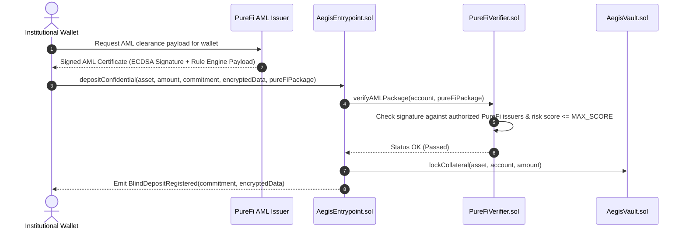

# PureFi Protocol AML & Compliance Integration

## 1. Overview
PureFi is a decentralized compliance and Anti-Money Laundering (AML) protocol providing privacy-preserving verification for institutional DeFi. Aegis Protocol integrates PureFi to ensure that only sanctioned-free, KYC-verified institutional counterparties can deposit collateral, borrow, or participate in blind liquidations.

## 2. Integration Flow



## 3. Cryptographic Verification Structure

### 3.1 PureFi Verification Package
The institutional caller provides a `PureFiPackage`:
```solidity
struct PureFiPackage {
    bytes signature;         // ECDSA signature from PureFi Issuer
    uint256 ruleId;          // Rule identifier (e.g., Rule 43: Institutional KYC + AML Tier 1)
    uint256 riskScore;       // Risk score computed off-chain (0 - 100)
    uint256 validUntil;      // Expiration timestamp
    bytes payload;           // Additional compliance metadata
}
```

### 3.2 On-Chain Verification
The `PureFiVerifier.sol` contract validates:
1. `validUntil >= block.timestamp`
2. `riskScore <= maxAllowedRiskScore` (Institutional default: $\le 25$)
3. Signature verification recovers an authorized PureFi issuer address:
   $$\text{signer} = \text{ecrecover}(\text{prefixedHash}, v, r, s)$$
4. Guarantees that no PII (Personally Identifiable Information) touches the Horizen L3 blockchain.
